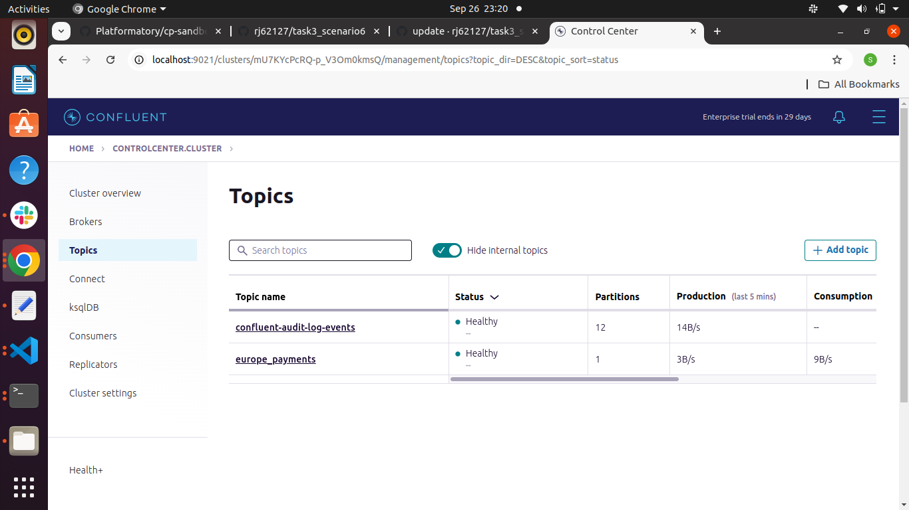

## Problem Statement

The client has created a new topic `europe_payments` but is unable to produce/consume from the topic from the host `kfkclient` using the user `kafkaclient1` using the following commands:

```
kafka-console-producer --bootstrap-server kafka1:19092 --producer.config /opt/client/client.properties --topic europe_payments

kafka-console-consumer --bootstrap-server kafka1:19092 --consumer.config /opt/client/client.properties --from-beginning --topic europe_payments
```

The client is using SASL/PLAIN over PLAINTEXT with the user `kafkaclient1`

The error message seen in the console producer and consumer for `europe_payments`: 

```
[2023-07-26 12:18:20,309] WARN [Producer clientId=console-producer] Error while fetching metadata with correlation id 4 : {europe_payments=TOPIC_AUTHORIZATION_FAILED} (org.apache.kafka.clients.NetworkClient)
[2023-07-26 12:18:20,409] ERROR [Producer clientId=console-producer] Topic authorization failed for topics [europe_payments] (org.apache.kafka.clients.Metadata)
[2023-07-26 12:18:20,411] ERROR Error when sending message to topic europe_payments with key: null, value: 6 bytes with error: (org.apache.kafka.clients.producer.internals.ErrorLoggingCallback)
org.apache.kafka.common.errors.TopicAuthorizationException: Not authorized to access topics: [europe_payments]
```

### Solution Overview:

1. Proper SSL Configuration for all Kafka brokers (kafka1, kafka2, kafka3) to ensure secure communication using certificates.
2. Fix misconfigurations in the client.properties file (e.g., sasl.jaas.config for username and password).
3.Correct server.properties.
4.Create config Directory.
5.Update Docker Compose.

### Prerequisites:

Before starting, ensure no other versions of the Kafka sandbox are running. Clean up any previous Docker containers and volumes:

```
docker-compose down -v
```

### Step 1: Kafka SSL Setup Guide

Objective: Configure SSL for a Kafka cluster with three brokers (kafka1, kafka2, kafka3) to ensure secure communication.

#### 1.1 Create Your Own Certificate Authority (CA)

```
openssl req -new -x509 -days 365 -keyout ca-key -out ca-cert -subj "/C=DE/ST=NRW/L=MS/O=juplo/OU=kafka/CN=Root-CA" -passout pass:kafka-broker
```

#### 1.2 Create Truststore and Import Root CA

```
keytool -keystore kafka.server.truststore.jks -storepass kafka-broker -import -alias ca-root -file ca-cert -noprompt
```

#### 1.3 Create Keystore for Kafka Broker

```
keytool -keystore kafka.server.keystore.jks -storepass kafka-broker -alias kafka1 -validity 365 -keyalg RSA -genkeypair -keypass kafka-broker -dname "CN=kafka1,OU=kafka,O=juplo,L=MS,ST=NRW,C=DE"
```

#### 1.4 Generate Certificate Signing Request (CSR)

```
keytool -alias kafka1 -keystore kafka.server.keystore.jks -certreq -file cert-file -storepass kafka-broker -keypass kafka-broker
```

#### 1.5 Sign the Certificate Using the CA

```
openssl x509 -req -CA ca-cert -CAkey ca-key -in cert-file -out cert-signed -days 365 -CAcreateserial -passin pass:kafka-broker -extensions SAN -extfile <(printf "
[SAN]
subjectAltName=DNS:kafka1,DNS:localhost")
```

#### 1.6 Import CA Certificate into Keystore

```
keytool -importcert -keystore kafka.server.keystore.jks -alias ca-root -file ca-cert -storepass kafka-broker -keypass kafka-broker -noprompt
```

#### 1.7 Import Signed Certificate into Keystore

```
keytool -keystore kafka.server.keystore.jks -alias kafka1 -import -file cert-signed -storepass kafka-broker -keypass kafka-broker -noprompt
```

Repeat steps 1.3 to 1.7 for other brokers (kafka2, kafka3).

### Step 2: Fix Client Properties File

#### Incorrect configuration:

```
sasl.jaas.config=org.apache.kafka.common.security.plain.PlainLoginModule required username="kafkaclient1" password="kafkaclient1-secret";
```

#### Corrected configuration:

```
sasl.jaas.config=org.apache.kafka.common.security.plain.PlainLoginModule required username="bob" password="bob-secret";
```

### Step 3: Correct server.properties

#### Uncommented and corrected lines:

```
authorizer.class.name=io.confluent.kafka.security.authorizer.ConfluentServerAuthorizer
super.users=User:kafka1;User:kafka2;User:kafka3;User:bob;User:admin_user;User:alice
confluent.license=ZK_ACL,CONFLUENT
```

### Step 4: Create config Directory

```
config/kafka/admin.properties:
security.protocol=SASL_PLAINTEXT
sasl.mechanism=PLAIN
sasl.jaas.config=org.apache.kafka.common.security.plain.PlainLoginModule required username="admin_user" password="admin_password";
```

### Step 5: Update Docker Compose

Add the following line to volumes sections in both `kfkclient` and `kafka1` services:

```
- ./config/kafka:/etc/kafka/config
```

```yaml
services:
  kfkclient:
    build: ./client
    volumes:
      - ./client:/opt/client
      - ./config/kafka:/etc/kafka/config   # <-- Add this line

  kafka1:
    image: confluentinc/cp-server:7.4.0
    volumes:
      - ./config/kafka:/etc/kafka/config   # <-- Add this line
```


This is a screenshot of the fixed issue:





